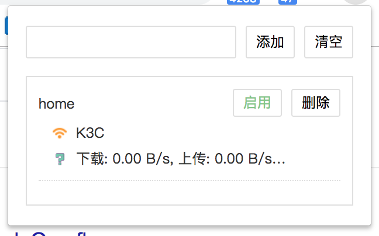

# Pinned
> chrome extension for pinned tabs

[下载地址](https://chrome.google.com/webstore/detail/pinned-tabs/biccgodmohjplafdhicdhkdeeejcmgia)

1. 需要固定的标签右键固定标签
2. 打开扩展输入名称 保存 已固定的标签
3. 选择启用 下次将会自动打开启用的标签组
4. [github](https://github.com/0851/pinned)
5. [演示视频](https://raw.githubusercontent.com/0851/pinned/master/images/use.mp4)
